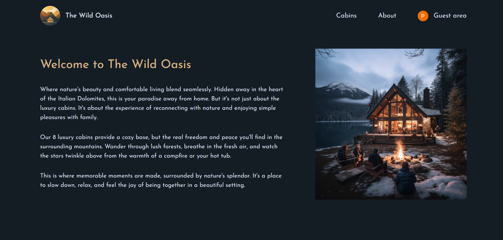

# The Wild Oasis – Modern Cabin Booking Platform

Welcome to **The Wild Oasis**, a full-stack web application for booking modern cabins. This project demonstrates a production-grade implementation of a booking system, featuring user authentication, real-time payments, and a seamless user experience. Built with the latest technologies, it is designed to be scalable, maintainable, and developer-friendly.

---

## 🚀 Features

- **Modern UI/UX**: Responsive, accessible, and visually appealing interface using Tailwind CSS.
- **Cabin Listings**: Browse, filter, and view detailed information about available cabins.
- **Booking System**: Select dates, specify guests, and reserve cabins with real-time availability checks.
- **User Authentication**: Secure sign-up, login, and session management with OAuth (Google) support.
- **Stripe Payments**: Integrated Stripe for secure, real-time credit card payments.
- **User Dashboard**: Manage bookings, view reservation history, and update profile.
- **Admin Features**: (If applicable) Manage cabins, view all reservations, and handle user accounts.
- **API Routes**: RESTful endpoints for bookings, cabins, and authentication.
- **Optimized Performance**: Server-side rendering, code splitting, and image optimization.
- **Error Handling**: Friendly error messages and loading states throughout the app.

---

## 🛠️ Tech Stack

- **Frontend**:  
  - [Next.js 13+ (App Router)](https://nextjs.org/)  
  - [React 18](https://react.dev/)  
  - [Tailwind CSS](https://tailwindcss.com/)  
  - [date-fns](https://date-fns.org/) for date manipulation

- **Backend**:  
  - [Next.js API Routes](https://nextjs.org/docs/app/building-your-application/routing/router-handlers)  
  - [Supabase](https://supabase.com/) (PostgreSQL, Auth, Storage)  
  - [Stripe](https://stripe.com/) for payments

- **Authentication**:  
  - [NextAuth.js](https://next-auth.js.org/) with Google OAuth

- **Other Tools**:  
  - [ESLint](https://eslint.org/) & [Prettier](https://prettier.io/) for code quality  
  - [PostCSS](https://postcss.org/)  
  - [pnpm](https://pnpm.io/) for fast package management

---

## 📁 Project Structure

```
app/
  _components/         # Reusable React components (forms, UI, context)
  _lib/                # Server actions, data fetching, Supabase client
  _styles/             # Global styles (Tailwind CSS)
  about/               # About page
  account/             # User dashboard, profile, reservations
  api/                 # API routes (auth, cabins, payment)
  cabins/              # Cabin listing and detail pages
  login/               # Login page
public/                # Static assets (images, icons)
```

---

## 🧑‍💻 Getting Started

1. **Clone the repository:**
   ```sh
   git clone <your-repo-url>
   cd the-wild-oasis
   ```

2. **Install dependencies:**
   ```sh
   pnpm install
   # or
   npm install
   ```

3. **Set up environment variables:**
   - Copy `.env.local.example` to `.env.local` and fill in your Supabase and Stripe credentials.

4. **Run the development server:**
   ```sh
   pnpm dev
   # or
   npm run dev
   ```

5. **Open [http://localhost:3000](http://localhost:3000) in your browser.**

---

## 📝 Environment Variables

Create a `.env.local` file in the root with the following (example):

```
NEXT_PUBLIC_SUPABASE_URL=your_supabase_url
NEXT_PUBLIC_SUPABASE_ANON_KEY=your_supabase_anon_key
STRIPE_SECRET_KEY=your_stripe_secret_key
NEXTAUTH_URL=http://localhost:3000
GOOGLE_CLIENT_ID=your_google_client_id
GOOGLE_CLIENT_SECRET=your_google_client_secret
```

---

## 🧪 Testing

- Manual testing via the UI.
- (Optional) Add unit/integration tests using [Jest](https://jestjs.io/) and [React Testing Library](https://testing-library.com/).

---

## 📦 Deployment

- **Vercel**: Recommended for seamless Next.js deployments.
- **Other Platforms**: Supported via Docker or Node.js hosting.

---

## 📚 Learning Outcomes

- Full-stack development with Next.js (App Router)
- Real-world Stripe payment integration
- Authentication with NextAuth.js and Supabase
- Scalable React component architecture
- Modern CSS with Tailwind
- API design and server actions in Next.js

---

## 🙋‍♂️ About Me

Hi, I'm Punyansh singla, a passionate full-stack developer. This project showcases my ability to build robust, modern web applications using the latest technologies.  
Feel free to reach out for collaboration or questions!

---

## 📄 License

This project is for educational and demonstration purposes.

---

## 🌐 Live Demo

https://wild-oasis-website-website.vercel.app/

---


## 📸 Project Screenshots

<p align="center">
  
  
</p>
<p align="center">
  
  
</p>

